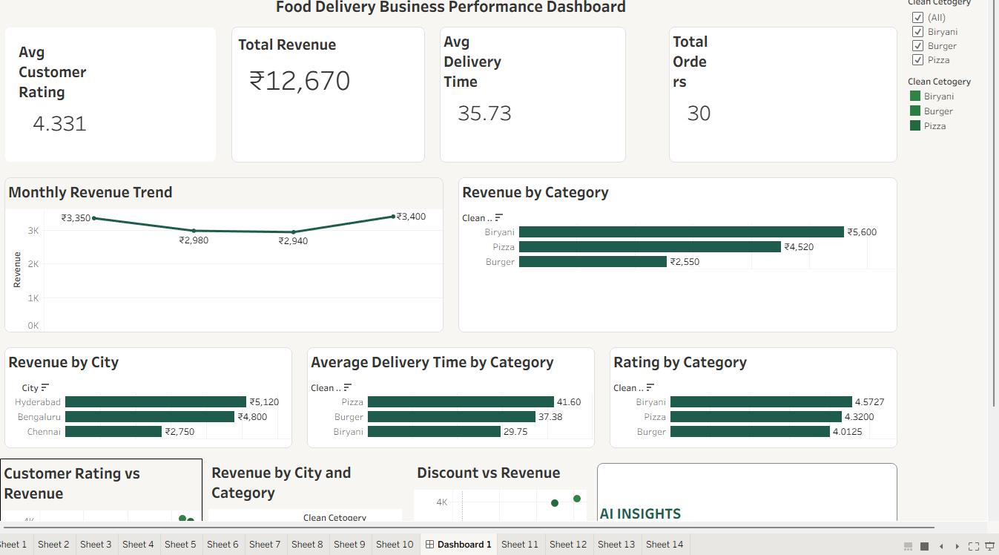

# Food Delivery Business Performance Analysis

## 📊 Project Overview

This project analyzes food delivery business performance using Tableau.

The dashboard provides insights into revenue, customer ratings, delivery time, orders, discounts, categories, and city-level performance.

## 🛠️ Tools Used

- Tableau
- Data Visualization
- Calculated Fields
- Filters and Parameters
- Dashboard Design
- Data Analysis

## 📈 Dashboard Insights

The dashboard analyzes:

- Total Revenue
- Total Orders
- Average Customer Rating
- Average Delivery Time
- Monthly Revenue Trend
- Revenue by Food Category
- Revenue by City
- Average Delivery Time by Category
- Customer Rating by Category
- Customer Rating vs Revenue
- Discount vs Revenue

## 🔍 Key Findings

- Biryani generated the highest revenue among the categories.
- Hyderabad generated the highest city-level revenue.
- Pizza had the highest average delivery time.
- Biryani had the highest average customer rating.
- The sample does not show a clear relationship between customer rating and revenue.

## 🖼️ Dashboard

## 🎯 Objective

The objective of this project is to demonstrate practical skills in data visualization, dashboard development, and business-oriented data analysis using Tableau.
